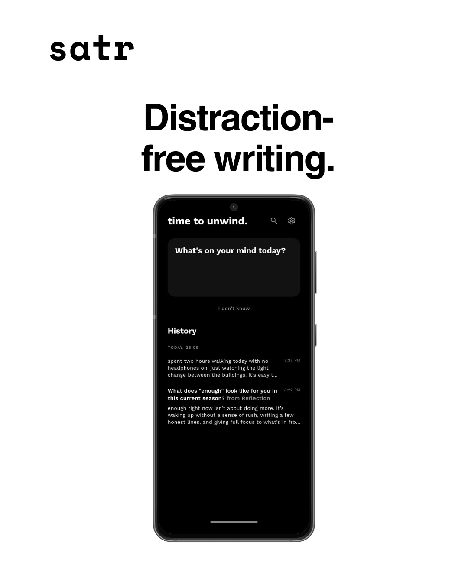
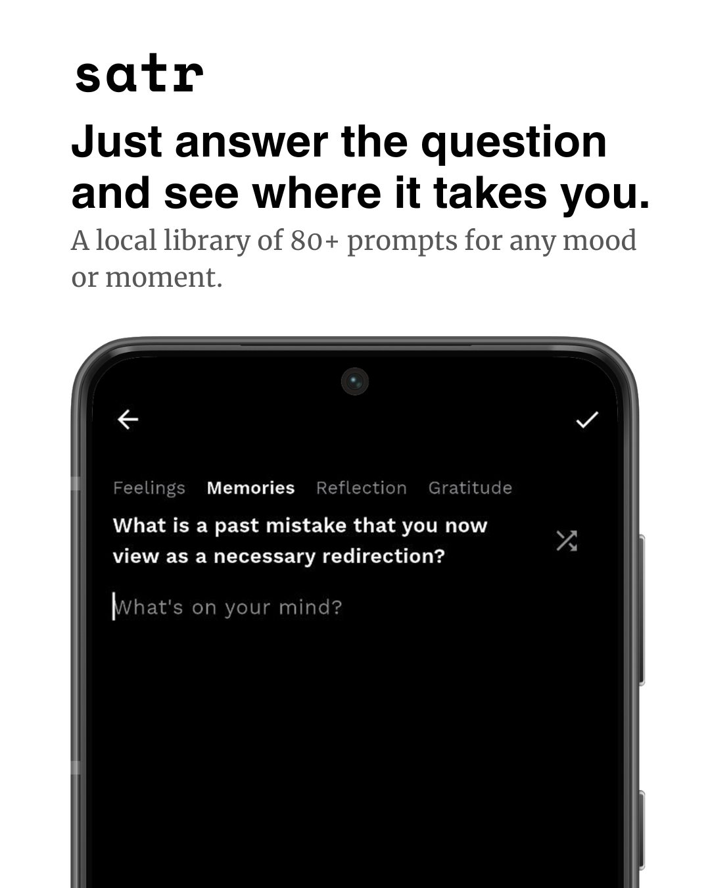

# satr

[](https://github.com/mohabnamira/satr/actions/workflows/release.yml)

**A quiet, private journal that starts the sentence for you.**

satr (Arabic: سطر, "a line") is an offline-first journaling app built with Flutter. It is designed for people who want to write but do not know where to begin. Instead of a blank page, satr offers a calm writing surface and a library of reflective prompts, and keeps every entry on your device.

> Status: v1.0.0 released — see [Releases](https://github.com/mohabnamira/satr/releases) for the changelog

## Download
Grab the latest APK from [Releases](https://github.com/mohabnamira/satr/releases/latest) — no build required.


---

## Table of Contents

- [Key Features](#key-features)
- [Download](#download)
- [Visual Showcase](#visual-showcase)
- [Tech Stack](#tech-stack)
- [System Architecture](#system-architecture)
- [Getting Started](#getting-started)
- [Project Structure](#project-structure)
- [Roadmap](#roadmap)
- [Contributing](#contributing)
- [License](#license)

---

## Key Features

### Prompt-driven writing

- Four prompt categories: **Feelings**, **Memories**, **Reflection**, and **Gratitude**, with 80 curated prompts in total.
- An **"I don't know"** action on the home screen opens the editor with a randomly selected prompt.
- Inside the editor, users can switch category, shuffle for another prompt, or tap the selected category again to return to the full pool.
- Prompts are revealed with a typewriter animation to keep the moment unhurried.
- The prompt used (and its category) is stored with the entry and displayed in history as a bold title with a muted source label, for example "from Reflection".

### Entry management

- Create, edit, and delete entries.
- Swipe-to-delete with a floating **Undo** toast.
- Each entry stores a creation timestamp, an optional last-updated timestamp, and optional prompt metadata.
- Entries are grouped by day in history using uppercase date dividers (for example, `TODAY, 28.09`).

### Search

- Animated, expandable search bar on the home screen.
- Live filtering of entry content as you type.

### Bilingual and right-to-left aware

- Automatic text-direction detection per entry, prompt, and input field, so Arabic and English content each render with the correct direction and alignment.
- Bundled Noto Sans Arabic as a font fallback alongside Work Sans.

### Privacy and security

- **Offline-first.** There is no backend, no account, no analytics, and no network dependency. Entries never leave the device.
- **Optional 4-digit PIN lock**, stored through the platform's secure storage (Keychain on iOS and macOS, Keystore-backed storage on Android).
- Brute-force friction: a 30-second cooldown after every five consecutive failed attempts.
- PIN can be enabled, changed, or removed from settings.

### Settings and data control

- Enable, disable, or change the PIN lock.
- **Export** entries as a backup.
- **Import** entries from a backup, with validation.
- **Clear all data**, guarded by a confirmation dialog.
- Privacy policy sheet describing the offline-first model, and an in-app version display.

### Interface details

- Pure black dark theme and pure white light theme, following the system setting.
- Single typeface (Work Sans) with hierarchy expressed through weight and size.
- Hero transition from the home card into the editor.
- Unified floating pill toast system for confirmations and undo actions.
- Three-page onboarding shown on first launch only (persisted with a Hive flag).
- Lowercase, time-of-day-aware greetings on the home screen.
- Quiet empty states, for example `a quiet page.`

---

## Visual Showcase

### Overview
A quiet space designed specifically for the moment you want to write but do not know where to begin.


### Home
Distraction-free environment with a time-aware greeting, a single prompt card, an "I don't know" quick action, and chronological entry history grouped by day.



### Editor & Prompts
A calm writing surface that reveals prompts line by line, backed by a local library of over 80 prompts across feelings, memories, reflection, and gratitude.



### Security & Privacy
Strictly offline-first experience with optional 4-digit PIN protection stored safely in device secure storage.


---

## Tech Stack

| Category | Technology | Purpose |
|---|---|---|
| Framework | Flutter (Dart 3) | Cross-platform UI |
| State management | Riverpod (`flutter_riverpod`) | Providers, stream-backed data, UI state |
| Local database | Hive (`hive`, `hive_flutter`) | Offline persistence of entries and settings |
| Code generation | `hive_generator`, `build_runner` | Type adapters for stored models |
| Secure storage | `flutter_secure_storage` | PIN storage in the platform keystore |
| Identifiers | `uuid` | Unique entry IDs |
| App metadata | `package_info_plus` | Version display in settings |
| Navigation | Flutter Navigator (`MaterialPageRoute`, `PageRouteBuilder`) | Screen transitions |
| Styling | Custom `ThemeData` tokens | Light and dark themes without a UI kit |
| Typography | Work Sans, Noto Sans Arabic | Latin text and Arabic fallback |
| Linting | `flutter_lints` | Static analysis |
| Assets tooling | `flutter_launcher_icons` | App icon generation |
| Backend | None | Fully local by design |
| Authentication | Local PIN only | No accounts or remote auth |
| Deployment | Local builds (APK, AAB, iOS archive) | Store distribution is out of scope for V1 |

---

## System Architecture

satr is a single-device, local-only application. Data flows in one direction through three layers:

### Data flow

1. **Startup.** `main()` initializes Hive, registers the `JournalEntry` adapter, opens the `journalEntries` and `settings` boxes, and reads the PIN and first-launch state. These values are injected into the widget tree as Riverpod provider overrides, so the first frame renders with correct state and no loading flash.
2. **Gate.** `LockGate` decides which screen to show: onboarding on first launch, the PIN screen when a PIN exists and the app is locked, otherwise the home screen.
3. **Reading.** `JournalRepository.watchEntries()` yields the current list and then re-emits on every Hive box change. A `StreamProvider` exposes this to the UI, and a derived `filteredEntriesProvider` applies the live search query.
4. **Writing.** Screens call repository methods (`addEntry`, `updateEntry`, `deleteEntry`, `restoreEntry`, `clearAllEntries`) through providers. Because history listens to the box stream, the UI updates automatically after each write.
5. **Undo.** Deleting an entry removes it from the box and shows a toast holding a callback that re-inserts the same object.

### State management

| Concern | Mechanism |
|---|---|
| Entry list | `StreamProvider<List<JournalEntry>>` backed by `Box.watch()` |
| Search | `StateProvider<String>` plus a derived filtering `Provider` |
| Lock state | `StateProvider<bool>` overridden at startup from secure storage |
| First launch | `StateProvider<bool>` persisted in the Hive settings box |
| Prompts | `Provider<PromptRepository>` (stateless, random selection with exclusion of the current prompt) |

### Persistence

| Data | Store | Notes |
|---|---|---|
| Journal entries | Hive box `journalEntries` | Typed box using a generated `JournalEntryAdapter` |
| App settings | Hive box `settings` | Keys such as `is_first_launch`, `themeMode`, `hapticsEnabled` |
| PIN | `flutter_secure_storage` | Never written to Hive |

### Data model

```dart
class JournalEntry extends HiveObject {
  String id;               // UUID v4
  String content;
  DateTime createdAt;
  DateTime? updatedAt;
  String? promptUsed;      // Prompt text, if the entry started from a prompt
  String? promptCategory; // Category name: feelings, memories, reflection, gratitude
}